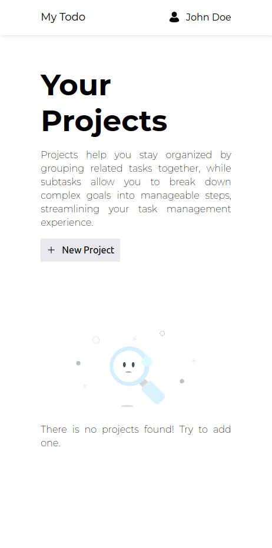
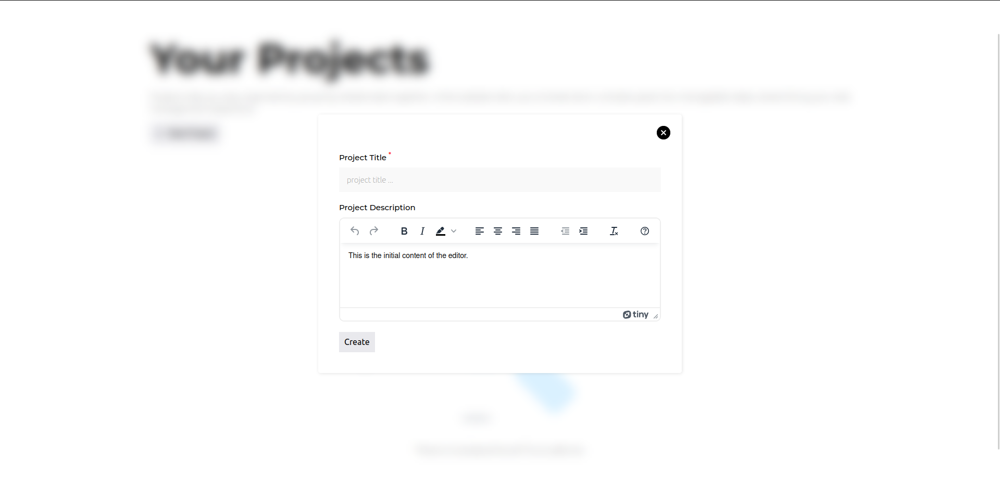
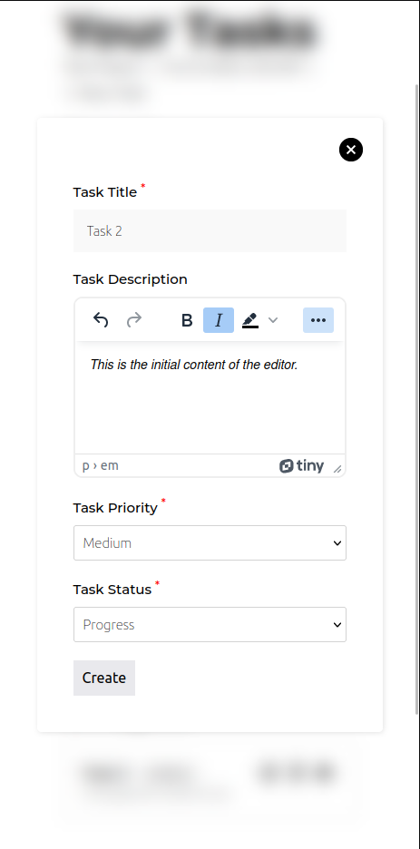
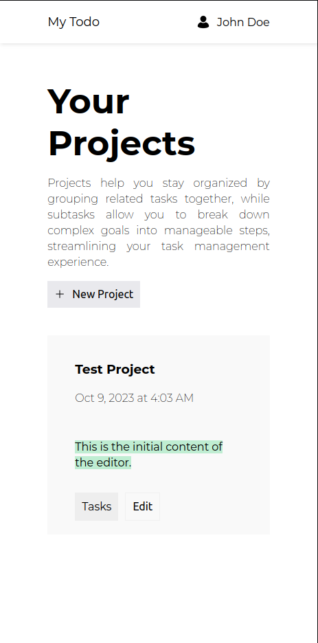
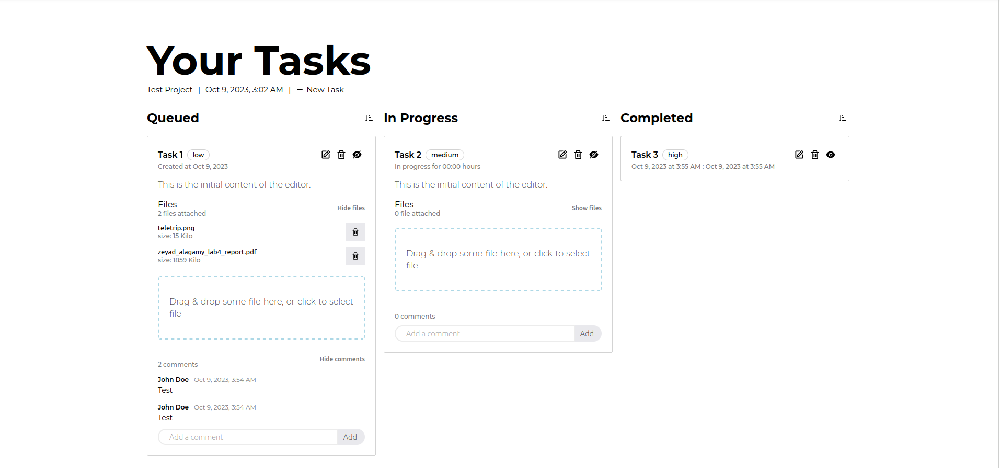

# TODO-APP

## Description

This is a simple todo app that allows you to add, edit, and delete Projects. You can also add, edit, and delete tasks to each project. You can also mark tasks as queued, progress, or completed.

## Library Directory 📙

- React
- Redux
- React-Redux
- Redux-presist
- React-Router
- React-Icons
- React-dropzone
- TinyMCE

## Live Demo 🎥

[Live Demo Link](https://zeyadajamy.github.io/todo/)

## Screenshots 📷












## Getting Started 🚀

To get a local copy up and running follow these simple example steps.

### Prerequisites

- NodeJS
- NPM
- Git

### Setup

1. Clone the project locally.
2. Go to the project directory `todo`.
3. Run `npm install` to install the dependencies, ensure that you are connected to the internet and have NodeJS installed.
4. Run `npm start` to start the app. The app will open in your default browser.
5. Go to `http://localhost:3000/#/todo` to see the app in action.

### Project Structure

- Two main directories: `public`, `src`.
- `src` contains all the source code (assets, components, store, hooks).
- `public` contains the `index.html` file and the `favicon.ico` file.

```
├── public
│   ├── index.html
│   └── favicon.ico
├── src
│   ├── assets
│   ├── components
│   │   ├── 404
│   │   │   ├── index.tsx
│   │   │   └── styles.ts
│   │   ├── file-upload
│   │   │   ├── index.tsx
│   │   │   └── styles.ts
│   │   ├── header
│   │   │   ├── index.tsx
│   │   │   └── styles.ts
│   │   ├── not-found
│   │   │   ├── index.tsx
│   │   │   └── styles.ts
│   │   ├── project
│   │   │   ├── index.tsx
│   │   │   ├── styles.ts
│   │   │   ├── project-form.tsx
│   │   │   └── project-list.tsx
│   │   ├── tasks
│   │   │   ├── index.tsx
│   │   │   ├── styles.ts
│   │   │   ├── task-form.tsx
│   │   │   ├── column.tsx
│   │   │   └──  task-table.tsx
│   │   ├── tinymce
│   │   │   └── index.ts
│   │   ├── window-modal
│   │   │   ├── index.tsx
│   │   │   └── styles.ts
│   │   └── layout.tsx
│   ├── hooks
│   │   └── useStore.ts
│   ├── store
│   │   ├── actions
│   │   │   └── projectActions.ts
│   │   ├── reducers
│   │   │   └── projectsReducer.ts
│   │   └── store.ts
│   ├── types.ts
│   ├── index.tsx
│   ├── package.json
│   ├── package-lock.json
│   ├── README.md
│   └──  tsconfig.json
```

## What is missing

### Data is not shared between different devices

- Since we are using a local storage and redux-persist, the data is not shared between different devices. This can be fixed by using a database and a backend.
- Also for that we need to add authentication and authorization.
- Use `redux-query` to handle the async actions.

### Add more features

- Add project status (active, archived, completed)
- Add search functionality

### Create the bot script

- Create a bot script that will create a project and add tasks to it.

## Author

👤 **Zeyad Ajamy**

- GitHub: [@zeyadajamy](https://github.com/zeyadAjamy)

## 🤝 Contributing

Contributions, issues, and feature requests are welcome!
